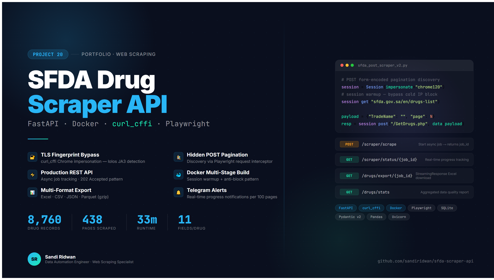

<!-- HEADER -->
<div align="center">


<br/>

[](https://python.org)
[](https://fastapi.tiangolo.com)
[](https://docker.com)
[](https://github.com/yifeikong/curl_cffi)
[](https://sqlite.org)
[](LICENSE)

</div>

---

## Demo

<div align="center">
  <a href="https://youtube.com/watch?v=-kWFCRtUua8">
    
  </a>
  <br/>
  <sub><i>Click to watch — scraper run, monitor progress, Excel output walkthrough</i></sub>
</div>

<br/>

<div align="center">
  <video src="https://github.com/user-attachments/assets/23e6e240-fa4f-4d65-b83f-a84ef72563f8" 
         width="860" 
         controls 
         autoplay 
         loop 
         muted>
  </video>
</div>

</div>

---

## Overview

```
  ╔══════════════════════════════════════════════════════════╗
  ║  ██████  ███████ ██████   █████                          ║
  ║  ██      ██      ██   ██ ██   ██    Saudi Food &         ║
  ║  ███████ █████   ██   ██ ███████    Drug Authority       ║
  ║       ██ ██      ██   ██ ██   ██    Drug Registry        ║
  ║  ██████  ██      ██████  ██   ██    Scraper API          ║
  ╠══════════════════════════════════════════════════════════╣
  ║  8,760 drugs  ·  438 pages  ·  33 min  ·  11 fields     ║
  ╚══════════════════════════════════════════════════════════╝
```

Production-grade REST API that scrapes, stores, and serves drug records from the Saudi Food & Drug Authority (SFDA) public registry — defeating TLS fingerprinting at the SSL handshake level, discovering hidden POST-based pagination via Playwright browser interception, and delivering everything in a containerized FastAPI service with async job tracking, Telegram alerts, and styled Excel export.

| Metric | Value |
|-------:|-------|
| 💊 Drugs scraped | **8,760** |
| 📄 Pages processed | **438 pages × 20 drugs** |
| 🏷️ Fields per drug | **11** |
| ⏱️ Total runtime | **~33 minutes** |
| 🐳 Deployment | **Docker multi-stage** |
| 🔐 Anti-bot method | **curl_cffi chrome120** |
| 📬 Notifications | **Telegram Bot** |
| 📊 Export formats | **Excel · JSON · CSV · Parquet** |

---

## Technical Challenges Solved

### Challenge 1 — TLS Fingerprint Block (WinError 10054)

**Problem:** The SFDA Microsoft IIS server performs a JA3 fingerprint check at the SSL handshake level. Python's `requests` and `urllib3` are rejected before a single HTTP packet is sent — `ConnectionResetError(10054)`.

**Solution:** `curl_cffi` with `impersonate="chrome120"` replicates Chrome's exact TLS handshake — cipher suite ordering, extension list, and session ticket. Server sees legitimate browser traffic.

```python
# ❌ Standard requests — dropped at SSL handshake
import requests
r = requests.post(URL, data=payload)
# → ConnectionResetError(10054): connection forcibly closed ✗

# ✅ curl_cffi — Chrome TLS impersonation
from curl_cffi import requests as cffi_requests
session = cffi_requests.Session(impersonate="chrome120")
r = session.post(URL, data=payload)  # → HTTP 200 ✓
```

---

### Challenge 2 — Hidden POST Pagination (Discovered via Playwright)

**Problem:** SFDA uses POST form-encoded body for pagination — not URL query parameters. `?page=2` in the URL is completely ignored; the server always returns page 1.

**Discovery:** A Playwright script intercepted all XHR requests made by the real browser, saving them to `sfda_captured.json`. The captured payload revealed `method: POST` and `post_data: "TradeName=&Agent=&RegNo=&page=2"`.

```python
# ❌ GET query params — page parameter ignored, always returns page 1
GET /GetDrugs.php?page=2&pageSize=20  →  currentPage: 1 every time

# ✅ POST form-encoded — correct method (discovered via Playwright intercept)
POST /GetDrugs.php
Content-Type: application/x-www-form-urlencoded
Body: TradeName=&Agent=&ManufacturerName=&RegNo=&page=2  →  currentPage: 2 ✓
```

---

### Challenge 3 — Docker IP Rate Limiting (HTML instead of JSON)

**Problem:** Docker container IPs are detected as datacenter traffic. After ~40 requests, SFDA returns an HTML error page instead of JSON — causing `json.JSONDecodeError` and crashing the scraper.

**Solution:** Multi-layer anti-block system designed specifically for Docker environments:

```python
def validate_response(r) -> Tuple[Optional[List], Optional[str]]:
    # Detect HTML response BEFORE attempting JSON parse
    ct = r.headers.get("content-type", "").lower()
    if "text/html" in ct:
        # Rate limited — trigger 30s cooldown, not crash
        return None, "HTML_RESPONSE"

    first_char = r.text.strip()[0]
    if first_char not in ('{', '['):
        return None, "NON_JSON_RESPONSE"

    return r.json().get("data", {}).get("result", {}).get("results", []), None
```

Additional Docker-specific solutions: session warmup (visit homepage first for valid cookies), session rotation every 30 pages, adaptive delay 1.5–3.5s, 30-second cooldown on rate limit detection.

---

### Challenge 4 — Thread-Safe SQLite with Background Jobs

**Problem:** FastAPI background thread + SQLite concurrent writes = `database is locked` error.

**Solution:** Fetch-Only Pattern — scraper threads only fetch and return raw data; all SQLite writes happen sequentially on the main thread. No Lock mechanism needed, no bottleneck.

```python
# Workers: fetch only, return list — never touch DB
results, err = fetch_page(page, session)

# Main thread: single writer — thread-safe by design
save_drugs_batch(conn, job_id, results)
conn.execute("UPDATE jobs SET done_pages=? WHERE id=?", (page, job_id))
conn.commit()
```

---

## Output Structure

| # | Sheet / Format | Key Fields | Rows |
|---|---------------|-----------|------|
| 1 | **Drugs Data** (Excel Sheet 1) | registration_no, trade_name, scientific_name, manufacturer, country, category, status, license_holder, dosage_form, route, strength | **8,760** |
| 2 | **Summary** (Excel Sheet 2) | job_id, total_records, unique_drugs, export_date | 7 rows |
| 3 | **Data Quality** (Excel Sheet 3) | Processing notes, sanitization log | 11 rows |
| 4 | **CSV** `sfda_drugs_*.csv` | All 11 fields, UTF-8-sig encoded | **8,760** |
| 5 | **JSON** `sfda_drugs_*.json` | All 11 fields, force_ascii=False | **8,760** |
| 6 | **Parquet** `sfda_drugs_*.parquet` | All 11 fields, gzip compressed | **8,760** |

Excel formatting: dark blue header (`#1F4E78`), alternating row colors (`#D9E1F2`), auto-width columns, freeze panes at row 2, auto-filter enabled, Arabic character sanitization.

---

## Quick Start

### Install

```bash
# Clone
git clone https://github.com/sandiridwan/sfda-scraper-api.git
cd sfda-scraper-api

# Configure
cp .env.example .env
# Edit .env — add TELEGRAM_BOT_TOKEN and TELEGRAM_CHAT_ID
```

### Run (Docker — Recommended)

```bash
docker-compose up -d --build
curl http://localhost:8000/health
# → {"status":"ok","environment":"production","database":"ok","version":"1.0.0"}
```

### Run (Local)

```bash
python -m venv .venv
.venv\Scripts\activate        # Windows
pip install -r requirements.txt
uvicorn app.main:app --reload --port 8000
```

### Run (Standalone — No API)

```bash
python sfda_post_scraper_v2.py
# Exports CSV + JSON + Excel (EN) + Parquet to current directory
```

### Configuration

```env
# .env
TELEGRAM_BOT_TOKEN=7xxxxxxxxx:AAxxxxxx-xxxxx
TELEGRAM_CHAT_ID=123456789
APP_ENV=production
DATABASE_URL=./data/sfda.db
SFDA_MAX_PAGES=438
SFDA_TIMEOUT=30
SFDA_RETRY_MAX=5
SFDA_DELAY_MIN=0.8
SFDA_DELAY_MAX=2.0
```

### Trigger a Scrape

```bash
# Start job
curl -X POST http://localhost:8000/scraper/scrape \
  -H "Content-Type: application/json" \
  -d '{"max_pages": 438, "notify_telegram": true}'
# → {"job_id": "b20a7fb6", "status": "queued"}

# Monitor
curl http://localhost:8000/scraper/status/b20a7fb6
# → {"status":"done","total_drugs":8760,"progress_pct":100.0}

# Export
curl http://localhost:8000/drugs/export/b20a7fb6 --output sfda_drugs.xlsx

# Interactive docs
open http://localhost:8000/docs
```

---

## File Structure

```
sfda-scraper-api/
├── app/
│   ├── main.py                    # FastAPI app + lifespan + CORS
│   ├── config.py                  # Pydantic Settings (type-safe .env)
│   ├── database.py                # SQLite init + connection + indexes
│   ├── routers/
│   │   ├── scraper.py             # POST /scrape · GET /status · GET /results
│   │   └── drugs.py               # GET /drugs · GET /stats · GET /export/{id}
│   ├── services/
│   │   ├── scraper_service.py     # curl_cffi + warmup + retry + checkpoint
│   │   └── telegram_service.py   # started · milestone · done · failed
│   └── schemas/
│       └── models.py              # Pydantic v2 request/response models
├── sfda_post_scraper_v2.py        # Standalone scraper (no API required)
├── Dockerfile                      # Multi-stage: builder + slim runtime
├── docker-compose.yml              # Service config + volumes + healthcheck
├── requirements.txt
├── .env.example
├── .gitignore
├── .dockerignore
└── data/                           # SQLite volume (gitignored)
```

---

## Author

<div align="center">

**Sandi Ridwan**
Data Automation Engineer · Web Scraping Specialist · IBM-Certified Data Analyst

[](https://upwork.com)
[](https://github.com/sandiridwan)
[](mailto:sandyzvoster@gmail.com)

*"If you have data trapped behind a wall, I know how to get it out."*

</div>
